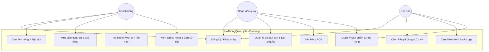
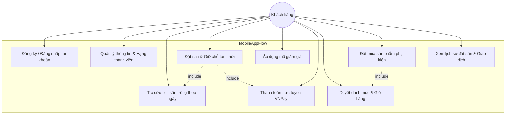
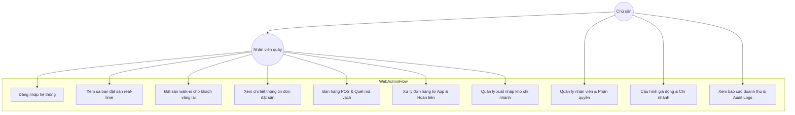
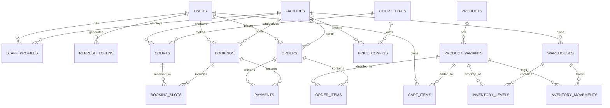

# HỌC VIỆN CÔNG NGHỆ BƯU CHÍNH VIỄN THÔNG
## KHOA CÔNG NGHỆ THÔNG TIN 2
---

# BÁO CÁO CUỐI KỲ
## ĐỀ TÀI: HỆ THỐNG QUẢN LÝ SÂN CẦU LÔNG (BADMINTON COURT MANAGEMENT SYSTEM)

**Môn học:** Phát triển phần mềm hướng dịch vụ (SOA)  
**Nhóm sinh viên thực hiện (Nhóm 21):**  
1. Trương Anh Tùng - N22DCCN195 (Phân hệ Web Admin & Backend quản lý sân bãi, lịch đặt)  
2. Nguyễn Đức Chính - N22DCCN110 (Phân hệ Web Admin & Backend quản lý bán lẻ, kho hàng, báo cáo)  
3. Nguyễn Sỹ Kim Bằng - N22DCCN106 (Phân hệ Mobile App & Backend đăng nhập, tài khoản)  
4. Nguyễn Hữu Ngọc Hoàng - N22DCCN129 (Phân hệ Mobile App & Backend mua hàng, thanh toán)  

---

## CHƯƠNG 1. GIỚI THIỆU ĐỀ TÀI

### 1.1 Bối cảnh và lý do chọn đề tài
Phong trào tập luyện và thi đấu cầu lông tại Việt Nam hiện đang phát triển vô cùng mạnh mẽ, kéo theo sự ra đời của hàng loạt các cụm sân và nhà thi đấu quy mô lớn nhỏ. Tuy nhiên, phần lớn các cơ sở này vẫn đang được quản lý bằng phương pháp thủ công hoặc các công cụ phân tán như sổ sách, bảng tính Excel, và tin nhắn qua Zalo/Facebook. 

Cách tiếp cận truyền thống này bộc lộ nhiều hạn chế nghiêm trọng:
- **Tình trạng trùng lịch (Double Booking):** Do cập nhật thủ công từ nhiều kênh dẫn đến xung đột giờ chơi của khách.
- **Thất thoát doanh thu từ dịch vụ phụ trợ:** Khó kiểm soát việc bán các phụ kiện và nước giải khát đi kèm.
- **Khó khăn trong đối soát:** Thiếu các báo cáo trực quan về hiệu suất lấp đầy sân và dòng tiền thực tế.

Nhận thấy nhu cầu cấp thiết về một giải pháp phần mềm chuyên biệt, khép kín cho mô hình kinh doanh sân cầu lông, nhóm quyết định thực hiện đề tài **"Hệ thống Quản lý Sân Cầu lông"** nhằm số hóa toàn diện quy trình vận hành từ khâu đặt sân online đến bán hàng trực tiếp tại quầy và quản lý kho bãi.

### 1.2 Mục tiêu đề tài
- **Mục tiêu tổng quát:** Xây dựng thành công hệ thống quản lý cơ sở cầu lông đa nền tảng gồm ứng dụng di động dành cho khách hàng và trang quản trị Web dành cho chủ sân/nhân viên, kết nối thông suốt qua một hệ thống API trung tâm.
- **Mục tiêu cụ thể:**
  - **Mảng Dịch vụ & Đặt sân:** Xây dựng cơ chế tra cứu lịch sân trống trực quan và đặt lịch trực tuyến theo thời gian thực.
  - **Mảng Bán hàng tại quầy (POS) & Thương mại điện tử:** Hỗ trợ bán hàng nhanh chóng bằng mã vạch và thanh toán qua QR VNPay.
  - **Mảng Quản trị & Vận hành:** Tự động trừ kho khi bán hàng, luân chuyển kho bãi và ghi nhận nhật ký hoạt động hệ thống chi tiết (Audit Logs).

### 1.3 Phạm vi đề tài
- **Phạm vi nghiệp vụ (Domain):** Tập trung vào 2 phân hệ chính:
  - **Domain 1: Booking & Facility:** Quản lý đặt lịch, sa bàn trực quan của cơ sở và giá động theo khung giờ vàng.
  - **Domain 2: E-commerce, Inventory & Staff:** Quản lý bán hàng POS tại quầy, giỏ hàng online của khách, xuất nhập kho và phân quyền nhân viên.
- **Phạm vi hệ thống:** 
  - **Web Admin:** Phục vụ nội bộ cho Ban quản lý (Admin) và Nhân viên (Staff).
  - **Mobile App:** Phục vụ Khách hàng (Customer) trên nền tảng di động.

### 1.4 Đối tượng sử dụng
- **Quản trị viên (Admin):** Chủ sân nắm toàn quyền cấu hình bảng giá, quản lý nhân viên và xem báo cáo doanh thu tổng thể.
- **Nhân viên (Staff):** Nhân viên trực quầy sử dụng POS bán hàng, check-in/check-out giờ chơi cho khách và nhập xuất kho.
- **Khách hàng (Customer):** Người chơi cầu lông tìm kiếm giờ trống, đặt chỗ trực tuyến và mua sắm phụ kiện thể thao.

### 1.5 Phân chia công việc
- **Web Admin (Trương Anh Tùng & Nguyễn Đức Chính):** Xây dựng trang Dashboard quản trị, cấu hình giá, sa bàn hiển thị lịch sân, module POS bán hàng và báo cáo doanh thu.
- **Mobile App (Nguyễn Sỹ Kim Bằng & Nguyễn Hữu Ngọc Hoàng):** Xây dựng ứng dụng di động cho khách hàng đặt sân, giỏ hàng mua sắm, tích hợp WebView thanh toán VNPay.

---

## CHƯƠNG 2. CƠ SỞ LÝ THUYẾT & CÔNG NGHỆ SỬ DỤNG

### 2.1 Nền tảng Backend
Backend đóng vai trò là lõi xử lý nghiệp vụ tập trung, phục vụ API đồng thời cho cả Web và Mobile.
- **Node.js & Express.js:** Đảm bảo tốc độ xử lý I/O bất đồng bộ vượt trội, phù hợp cho các truy vấn đặt sân cùng lúc của số lượng lớn người dùng.
- **TypeScript:** Cung cấp cơ chế kiểm soát kiểu dữ liệu nghiêm ngặt trong quá trình biên dịch (Compile-time type checking), giảm thiểu tối đa các lỗi logic tiềm ẩn.
- **MySQL & Sequelize ORM:** Sử dụng cơ sở dữ liệu quan hệ MySQL để quản lý dữ liệu giao dịch chặt chẽ kết hợp với Sequelize ORM để thực thi các DB Transaction, đảm bảo tính toàn vẹn (ACID).
- **Socket.io:** Xử lý truyền phát sự kiện tức thời (Real-time events) từ Backend đến Web Admin giúp cập nhật sa bàn đặt sân mà không cần tải lại trang.
- **VNPay SDK:** Tích hợp chữ ký số và mã hóa bảo mật để xử lý các giao dịch thanh toán không tiền mặt an toàn.

### 2.2 Nền tảng Web Admin
Phục vụ công việc quản lý nghiệp vụ chuyên sâu với tần suất cao.
- **React.js & Vite:** Xây dựng giao diện dạng Single Page Application (SPA), sử dụng công cụ build-tool thế mới Vite cho tốc độ phản hồi cực nhanh trong môi trường phát triển.
- **Ant Design (AntD):** Cung cấp các thư viện component bảng biểu (Tables), bộ lọc và form nhập liệu đồ sộ để thiết kế nhanh chóng giao diện quản trị trực quan.
- **Tailwind CSS:** Hỗ trợ tinh chỉnh giao diện linh hoạt qua các class tiện ích (Utility classes) mà không cần cấu trúc file CSS phức tạp.
- **React Router DOM:** Quản lý luồng định tuyến và bảo vệ các tuyến đường (Protected Routes) dựa trên phân quyền người dùng (Role-based access control).

### 2.3 Nền tảng Mobile
Ứng dụng di động giúp người chơi dễ dàng tra cứu giờ trống, tiến hành đặt sân, mua phụ kiện và xem lại lịch sử giao dịch cá nhân. 
- **React Native & Expo:** Dự án Mobile được phát triển bằng framework React Native. Thay vì phải viết bằng hai ngôn ngữ riêng biệt (Java/Kotlin cho Android và Swift cho iOS), React Native cho phép biên dịch từ một mã nguồn JavaScript/TypeScript duy nhất ra mã native của cả hai nền tảng. Dự án sử dụng môi trường Expo để đơn giản hóa quá trình thiết lập môi trường, test trực tiếp qua app Expo Go và build ứng dụng nhanh chóng.
- **React Navigation:** Thư viện tiêu chuẩn để quản lý luồng màn hình trên React Native. Dự án sử dụng kết hợp Stack Navigation (chuyển đổi màn hình tiến/lùi) và Bottom Tab Navigation (thanh menu điều hướng dưới đáy màn hình) để tổ chức ứng dụng.
- **Axios:** Thư viện HTTP Client đóng vai trò giao tiếp chính thức giữa Mobile App và Backend. Axios hỗ trợ tốt việc can thiệp vào Request/Response (thông qua Interceptors) để tự động đính kèm Token xác thực vào mỗi truy vấn.
- **React Native WebView:** Được sử dụng để nhúng trang thanh toán của VNPay trực tiếp vào bên trong ứng dụng. Khi khách hàng bấm "Thanh toán", ứng dụng sẽ hiển thị giao diện VNPay qua WebView và lắng nghe đường dẫn URL trả về (Return URL) để xác định kết quả thanh toán.

### 2.4 Công cụ hỗ trợ
- **pnpm:** Quản lý package tốc độ cao, tiết kiệm dung lượng ổ cứng nhờ cơ chế hard-link dùng chung file.
- **Postman:** Hỗ trợ kiểm thử và tài liệu hóa các API endpoints trước khi tích hợp vào frontend.
- **Git & GitHub:** Hệ thống quản lý mã nguồn phân tán giúp làm việc nhóm hiệu quả, quản lý các nhánh tính năng (Feature branches) và tránh xung đột code.

---

## CHƯƠNG 3. THIẾT KẾ HỆ THỐNG

### 3.1 Phân tích yêu cầu
#### 3.1.1 Yêu cầu chức năng phía Khách hàng (Mobile App)
Phân hệ Mobile App là giao diện chính giúp kết nối Khách hàng với các dịch vụ của cơ sở sân cầu lông. Để đảm bảo trải nghiệm người dùng mượt mà và tiện lợi, ứng dụng di động được thiết kế trực quan, cung cấp đầy đủ các tính năng tự phục vụ từ đặt lịch chơi đến mua sắm và quản lý tài khoản cá nhân.

Các yêu cầu chức năng chi tiết bao gồm:

**Xác thực và Quản lý Tài khoản (Authentication & Account Management):**
- Đăng ký & Đăng nhập: Khách hàng có thể dễ dàng tạo tài khoản bằng Email và số điện thoại, bảo mật mật khẩu bằng cơ chế băm. Sử dụng giao thức JWT (Access Token thời hạn ngắn và Refresh Token thời hạn dài) để duy trì trạng thái đăng nhập an toàn, hỗ trợ đăng xuất trên mọi thiết bị.
- Quản lý Hồ sơ Cá nhân: Cho phép người dùng cập nhật thông tin cá nhân (Họ tên, Số điện thoại, Ảnh đại diện), theo dõi Hạng thành viên (Standard, Student, VIP) và điểm tích lũy (Loyalty Points) nhận được từ các giao dịch.

**Đặt sân trực tuyến (Online Court Booking):**
- Tra cứu Lịch sân trống: Người dùng có thể lọc danh sách các Cơ sở (Facilities), chọn Ngày muốn chơi và xem danh sách các Sân (Courts). Hệ thống hiển thị trực quan các slot thời gian (ví dụ 60 phút) còn trống hoặc đã có người đặt.
- Giữ chỗ tạm thời (Slot Hold): Khi người dùng chọn slot và tiến hành thanh toán, hệ thống sẽ thực hiện giữ chỗ (Hold) tạm thời slot đó trong vòng 30 phút (sử dụng cơ chế khóa dòng MySQL Transaction Lock kết hợp với background job quét dọn tự động) để người dùng hoàn tất giao dịch mà không bị người khác tranh chấp đặt mất (Race Condition).
- Áp dụng Mã giảm giá (Promo Codes): Hệ thống tự động kiểm tra điều kiện (Giá trị đơn hàng tối thiểu, Ngày hết hạn, Lượt sử dụng tối đa) và áp dụng mã giảm giá tương ứng vào tổng tiền thanh toán.
- Thanh toán trực tuyến VNPay: Tích hợp trực tiếp WebView cổng thanh toán VNPay trong ứng dụng, cho phép khách hàng quét mã QR hoặc nhập thông tin thẻ ngân hàng/ứng dụng Mobile Banking để thanh toán nhanh chóng.

**Cửa hàng & Mua sắm trực tuyến (E-commerce / Shopping):**
- Xem danh mục sản phẩm: Duyệt qua các danh mục thiết bị phụ kiện cầu lông (Vợt, Giày, Quần áo, Cầu, Phụ kiện) với đầy đủ thông tin mô tả chi tiết, hình ảnh sản phẩm và điểm đánh giá từ cộng đồng.
- Quản lý Giỏ hàng (Cart Items): Khách hàng có thể thêm sản phẩm, lựa chọn các biến thể (như Kích cỡ, Màu sắc, Độ căng vợt), cập nhật số lượng hoặc xóa bớt mặt hàng trước khi thanh toán.
- Checkout & Theo dõi đơn hàng: Tạo đơn hàng online mua phụ kiện kèm theo khi đến chơi sân hoặc đặt giao hàng (nếu có).

**Quản lý lịch sử và Trải nghiệm người dùng:**
- Quản lý lịch cá nhân: Theo dõi chi tiết các lịch đặt sân sắp tới (thời gian, địa điểm, số sân), hỗ trợ hủy/đổi lịch đặt sân theo chính sách quy định tự động của từng cơ sở.
- Lịch sử Giao dịch: Xem lại chi tiết lịch sử tất cả các hóa đơn đặt sân và hóa đơn mua sắm trực tuyến cùng trạng thái thanh toán tương ứng.

#### 3.1.2 Yêu cầu chức năng phía Quản lý & Nhân viên (Web Admin)
Phân hệ Web Admin là trung tâm điều hành toàn bộ hoạt động kinh doanh của các cơ sở sân cầu lông. Do đặc thù phục vụ công việc nghiệp vụ cường độ cao, giao diện và chức năng của phân hệ này được thiết kế để tối ưu hóa thao tác, tốc độ xử lý và bao quát thông tin. Các yêu cầu chức năng được chia thành hai nhóm quyền chính: Nhân viên (Staff) và Quản trị viên (Admin). 
Nhóm chức năng dành cho Nhân viên (Vận hành hàng ngày):
Quản lý Lịch đặt sân (Booking Schedule / Sa bàn):
Hệ thống yêu cầu hiển thị lịch đặt sân dưới dạng "Sa bàn thời gian" (Time-block grid), cho phép Nhân viên có cái nhìn trực quan về trạng thái của tất cả các sân trong một ngày cụ thể.
Các trạng thái của sân (Trống, Đã đặt chưa thanh toán, Đã thanh toán, Đang sử dụng) phải được phân biệt rõ ràng bằng màu sắc.
Nhân viên có thể thao tác trực tiếp trên sa bàn để: Đặt sân nhanh cho khách vãng lai (walk-in) và xem chi tiết thông tin các đơn đặt sân.
Hệ thống Bán lẻ & Thanh toán tại quầy (POS - Point of Sale):
Giao diện POS yêu cầu tốc độ phản hồi tức thời. Cho phép Nhân viê
 n quét mã vạch (SKU) hoặc chọn trực tiếp nước uống/phụ kiện để thêm vào giỏ hàng.
Hỗ trợ đa phương thức thanh toán: Tiền mặt (tự động tính tiền thừa trả khách) và quét mã QR VNPay.
Xử lý Đơn hàng từ Khách hàng (App Order Management):
Quản lý danh sách đơn hàng online được phân loại rõ ràng theo tab: Chờ thanh toán, Chờ lấy hàng, Đã hoàn thành, Đã hủy.
Tính năng tối ưu UI: Cột dữ liệu hiển thị phải hỗ trợ gộp các ô (Merge Cells / RowSpan) dựa theo chi nhánh (Cơ sở), giúp Nhân viên dễ dàng phân loại và xử lý hàng loạt đơn hàng thuộc cơ sở mình quản lý mà không bị rối mắt.
Cung cấp tính năng "Hoàn tiền" (Refund) với form nhập lý do rõ ràng. Hệ thống yêu cầu tự động hoàn trả số lượng hàng hóa về kho khi thao tác hoàn tiền được thực hiện.
Nhóm chức năng dành cho Quản trị viên (Thiết lập & Bao quát):
Cấu hình Giá động (Dynamic Price Configuration):
Quản lý không chỉ áp dụng một mức giá cố định mà hệ thống yêu cầu hỗ trợ cấu hình giá linh hoạt theo khung giờ vàng (Ví dụ: 17h-20h giá cao hơn), ngày trong tuần, hoặc ngày Lễ/Tết.
Hệ thống tự động tính toán tổng tiền chính xác dựa trên việc trích xuất các khoảng thời gian giao nhau với cấu hình giá.
Quản lý Cơ sở vật chất & Chi nhánh:
Cho phép tạo mới, chỉnh sửa thông tin các Cơ sở (Facility). Quản lý danh sách các Sân (Courts) trực thuộc từng cơ sở cụ thể. 
Quản lý Tồn kho & Sản phẩm (Inventory & Products):
Quản lý thông tin hàng hóa, biến thể sản phẩm (Kích cỡ, Thể tích).
Hệ thống yêu cầu theo dõi số lượng tồn kho hiện tại ở từng cơ sở riêng biệt. Cung cấp tính năng nhập/xuất kho và xem lịch sử luân chuyển hàng hóa (Inventory Movement) để truy xuất khi thất thoát.

#### 3.1.3 Yêu cầu phi chức năng & Liên kết hệ thống
- **Chống trùng lịch (Double Booking Prevention):** Khi 2 khách hàng đồng thời bấm đặt cùng một slot sân tại cùng một thời điểm, hệ thống sử dụng cơ chế khóa ở mức cơ sở dữ liệu (Database Row Lock) để đảm bảo chỉ một giao dịch thành công.
- **Cơ chế trừ kho gộp (Bulk Adjustment):** Khi nhân viên quầy POS thanh toán hóa đơn gồm nhiều sản phẩm, hệ thống thực thi lệnh Bulk Update thay vì lặp từng lệnh SQL đơn lẻ nhằm tối ưu hóa truy vấn CSDL và tránh lỗi N+1 Query.
- **Bảo mật thanh toán qua IPN (Instant Payment Notification):** Sử dụng chữ ký số bảo mật từ VNPay gửi ngầm về server, đảm bảo trạng thái đơn hàng được cập nhật đúng đắn ngay cả khi khách hàng tắt ứng dụng đột ngột.

### 3.2 Sơ đồ Use Case (UML)

#### 3.2.1 Sơ đồ Use Case tổng quát



#### 3.2.2 Sơ đồ Use Case phân hệ Mobile App
Phân hệ Mobile App chủ yếu tập trung vào các chức năng hướng tới khách hàng, giúp tối ưu hóa quy trình đặt chỗ và mua sắm cá nhân một cách nhanh chóng.



#### 3.2.3 Sơ đồ Use Case phân hệ Web Admin
Phân hệ Web Admin đóng vai trò là trung tâm quản lý nghiệp vụ bán lẻ trực tiếp (POS), sa bàn cập nhật thời gian thực, quản lý hàng tồn kho, nhân sự và thiết lập hệ thống.



#### 3.2.4 Đặc tả Use Case Đặt Sân (Booking Flow)
1. **Actor:** Khách hàng (Mobile App) hoặc Nhân viên trực quầy (Web Admin).
2. **Pre-condition:** Tài khoản đã đăng nhập hệ thống thành công.
3. **Basic Flow:**
   - Người dùng chọn cơ sở, ngày chơi và loại sân.
   - Hệ thống truy vấn CSDL hiển thị sa bàn giờ trống.
   - Người dùng chọn các slot thời gian mong muốn và bấm Đặt sân.
   - Hệ thống thực hiện khóa dòng (Row-level lock) để xác thực tính khả dụng của slot.
   - Nếu slot hợp lệ, hệ thống tạo bản ghi Booking với trạng thái `pending` và chuyển hướng đến trang thanh toán.
   - Sau khi thanh toán thành công (qua VNPay hoặc Tiền mặt tại quầy), trạng thái chuyển sang `confirmed` và gửi sự kiện Socket.io cập nhật sa bàn của nhân viên.
4. **Alternative Flow:** Nếu slot sân đã bị giữ hoặc đặt bởi người khác trước đó 1 mili giây, hệ thống trả về lỗi "Giờ sân này đã có người đặt, vui lòng chọn khung giờ khác."

---

### 3.3 Thiết kế cơ sở dữ liệu
#### 3.3.1 Sơ đồ liên kết thực thể (ERD)



#### 3.3.2 Chi tiết thiết kế các bảng nghiệp vụ chính
##### Bảng 1. `users` (Quản lý người dùng)
| Tên trường | Kiểu dữ liệu | Ràng buộc | Mô tả |
|---|---|---|---|
| `id` | INT | PK, Auto Increment | Định danh duy nhất |
| `full_name` | VARCHAR(100) | Nullable | Họ và tên đầy đủ |
| `email` | VARCHAR(100) | Unique, Not Null | Email tài khoản |
| `phone` | VARCHAR(20) | Unique, Nullable | Số điện thoại |
| `password_hash` | VARCHAR(255) | Not Null | Mật khẩu băm (Bcrypt) |
| `role` | VARCHAR(50) | Not Null | Vai trò (`admin`, `staff`, `customer`) |
| `loyalty_points`| INT | Default: 0 | Điểm thành viên tích lũy |

##### Bảng 2. `facilities` (Quản lý chi nhánh/cơ sở)
| Tên trường | Kiểu dữ liệu | Ràng buộc | Mô tả |
|---|---|---|---|
| `id` | INT | PK, Auto Increment | Định danh cơ sở |
| `name` | VARCHAR(150) | Not Null | Tên chi nhánh (VD: Sân VIP Quận 1) |
| `address` | VARCHAR(255) | Not Null | Địa chỉ cụ thể |
| `open_time` | TIME | Default: '06:00:00' | Giờ mở cửa hàng ngày |
| `close_time` | TIME | Default: '22:00:00' | Giờ đóng cửa hàng ngày |
| `avatar_url` | VARCHAR(255) | Nullable | Đường dẫn ảnh đại diện chi nhánh |
| `cancel_policy` | JSON | Nullable | Cấu hình quy định hủy sân |
| `timezone` | VARCHAR(50) | Default: 'Asia/Ho_Chi_Minh' | Múi giờ của chi nhánh |
| `is_active` | TINYINT(1) | Default: 1 | Trạng thái hoạt động (1: Hoạt động, 0: Ngưng hoạt động) |

##### Bảng 3. `court_types` (Quản lý loại sân)
| Tên trường | Kiểu dữ liệu | Ràng buộc | Mô tả |
|---|---|---|---|
| `id` | INT | PK, Auto Increment | Định danh loại sân |
| `name` | VARCHAR(50) | Unique, Not Null | Tên loại sân (VD: badminton, tennis, table_tennis, football) |
| `surface` | VARCHAR(50) | Nullable | Chất liệu bề mặt sân (Ví dụ: Thảm sơn, Gỗ) |
| `is_indoor` | TINYINT(1) | Default: 1 | Sân trong nhà hay ngoài trời (1: Trong nhà, 0: Ngoài trời) |
| `description` | TEXT | Nullable | Mô tả chi tiết loại sân |
| `image` | VARCHAR(500) | Nullable | Đường dẫn ảnh minh họa loại sân |

##### Bảng 4. `courts` (Quản lý sân cụ thể)
| Tên trường | Kiểu dữ liệu | Ràng buộc | Mô tả |
|---|---|---|---|
| `id` | INT | PK, Auto Increment | Định danh sân |
| `facility_id` | INT | FK -> `facilities.id` | Thuộc cơ sở nào |
| `name` | VARCHAR(100) | Not Null | Tên sân (Ví dụ: Sân 1, Sân 2) |
| `court_type` | VARCHAR(50) | FK -> `court_types.name` | Loại sân cụ thể |
| `is_active` | TINYINT(1) | Default: 1 | Trạng thái hoạt động (1: Hoạt động, 0: Ngưng hoạt động) |

##### Bảng 5. `price_configs` (Cấu hình giá động)
| Tên trường | Kiểu dữ liệu | Ràng buộc | Mô tả |
|---|---|---|---|
| `id` | INT | PK, Auto Increment | Định danh cấu hình giá |
| `facility_id` | INT | FK -> `facilities.id` | Áp dụng cho cơ sở nào |
| `court_type` | VARCHAR(50) | FK -> `court_types.name` | Loại sân áp dụng |
| `start_time` | TIME | Not Null | Thời gian bắt đầu khung giờ |
| `end_time` | TIME | Not Null | Thời gian kết thúc khung giờ |
| `price_per_hour`| INT | Not Null | Đơn giá mỗi giờ (VNĐ) |

##### Bảng 6. `bookings` (Thông tin đặt sân)
| Tên trường | Kiểu dữ liệu | Ràng buộc | Mô tả |
|---|---|---|---|
| `id` | INT | PK, Auto Increment | Định danh booking |
| `user_id` | INT | FK -> `users.id`, Nullable | Người đặt (Null nếu là khách vãng lai) |
| `facility_id` | INT | FK -> `facilities.id` | Địa điểm sân chơi |
| `status` | VARCHAR(50) | Default: 'pending' | Trạng thái (`pending`, `confirmed`, `cancelled`) |
| `payment_status`| VARCHAR(50) | Default: 'unpaid' | Trạng thái tiền (`unpaid`, `paid`) |
| `total_cents` | INT | Not Null | Tổng giá trị hóa đơn (VNĐ) |

##### Bảng 7. `booking_slots` (Chi tiết các khung giờ đặt)
| Tên trường | Kiểu dữ liệu | Ràng buộc | Mô tả |
|---|---|---|---|
| `id` | INT | PK, Auto Increment | Định danh slot đặt sân |
| `booking_id` | INT | FK -> `bookings.id` | Liên kết hóa đơn đặt |
| `court_id` | INT | FK -> `courts.id` | Sân cụ thể được đặt |
| `start_at` | DATETIME | Not Null | Thời gian bắt đầu chơi |
| `end_at` | DATETIME | Not Null | Thời gian kết thúc chơi |
| `price_cents` | INT | Not Null | Đơn giá chốt tại thời điểm đặt |

---

### 3.4 Thiết kế kiến trúc hệ thống
#### 3.4.1 Giao tiếp thời gian thực qua Socket.IO
Để tránh việc nhân viên trực quầy liên tục phải bấm F5 tải lại trang để kiểm tra xem có khách nào vừa đặt sân mới hay không, hệ thống sử dụng kiến trúc thông điệp sự kiện thời gian thực (Real-time Message Passing):

```
[Mobile App / Web Khách] --(Đặt sân thành công)--> [Backend API]
                                                         |
                                                (Đẩy sự kiện qua Socket)
                                                         |
                                                         v
[Web Admin (Staff POS)] <------------------------- [Socket Server]
```

Sự kiện `booking_new` được kích hoạt ngay khi thanh toán được cập nhật hợp lệ. Giao diện Web của Staff lắng nghe kênh này và lập tức tô màu đỏ cho slot sân tương ứng trên sa bàn quản lý thời gian thực với độ trễ dưới 1 giây.

---

## CHƯƠNG 4. TRIỂN KHAI HỆ THỐNG

### 4.1 Kết quả đạt được
Hệ thống đã được hiện thực hóa đầy đủ các chức năng theo đúng kiến trúc thiết kế:
- **Phía Backend:** Triển khai API hoàn chỉnh bằng TypeScript và Express.js, đảm bảo toàn bộ luồng nghiệp vụ nhạy cảm như Đặt sân, Trừ kho và POS được thực thi qua Sequelize Transaction. Tích hợp cổng VNPay Sandbox hoạt động ổn định, xử lý giao dịch qua webhook (IPN).
- **Phía Web Admin:** Hoàn thiện giao diện sa bàn thời gian thực (Time-block grid) trực quan dựa trên thư viện Ant Design. Nhân viên trực quầy có thể kéo thả chọn giờ và thanh toán nhanh chóng. Tích hợp màn hình bán lẻ POS tự động hóa và báo cáo doanh thu dưới dạng biểu đồ cột.
- **Phía Mobile App:** Phát triển ứng dụng di động bằng React Native hiển thị giao diện đặt sân, lựa chọn ngày giờ, tích hợp cổng thanh toán VNPay bằng WebView nội bộ ứng dụng, và lịch sử giao dịch rõ ràng.

---

## CHƯƠNG 5. KẾT LUẬN

### 5.1 Đánh giá dự án
- **Ưu điểm:**
  - Thiết kế kiến trúc phân lớp hướng dịch vụ rõ ràng, tách biệt hoàn toàn giữa các nền tảng khách hàng và quản lý.
  - Sử dụng cơ chế DB Transaction và Database Lock giúp xử lý triệt để tranh chấp tài nguyên (Race Condition) và chống trùng lịch tuyệt đối.
  - Giao diện trực quan, thân thiện cho cả khách hàng lẫn nhân viên vận hành tại quầy.
- **Hạn chế:**
  - Hệ thống hiện tại mới chỉ tối ưu hóa tốt cho mô hình đơn chi nhánh tập trung, chưa có cơ chế luân chuyển kho đa cơ sở thông minh.
  - Chưa hỗ trợ đặt sân định kỳ cho khách hàng cố định (ví dụ đặt theo tháng, quý).

### 5.2 Hướng phát triển tương lai
- Phát triển thêm thuật toán AI để dự báo xu hướng giờ cao điểm và tối ưu hóa giá sân tự động (Dynamic Pricing) theo thời tiết và nhu cầu thực tế.
- Tích hợp thêm các cổng thanh toán ví điện tử phổ biến như MoMo, ShopeePay và Apple Pay để tối ưu hóa trải nghiệm khách hàng di động.
- Nâng cấp hệ thống báo cáo phân tích sâu (Analytics Dashboard) giúp chủ sân theo dõi chi tiết hiệu suất hoạt động của từng nhân sự và tỷ suất lợi nhuận ròng.
