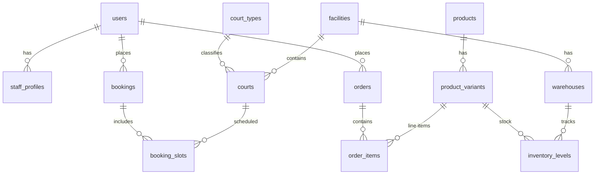

# Mô hình dữ liệu (ER, bảng, index, phân quyền)

## 1. Sơ đồ ER (Mermaid)

## 2. Bảng và mục đích

### 2.1 Người dùng & nhân viên

| Bảng | Mô tả |
|------|--------|
| `users` | id, email, phone, password_hash, role mặc định, created_at. |
| `staff_profiles` | user_id, facility_id (nullable nếu toàn hệ thống), job_title, active. |

### 2.2 Cơ sở & sân

| Bảng | Mô tả |
|------|--------|
| `facilities` | Chi nhánh: tên, địa chỉ, timezone, cấu hình hủy đặt (JSON hoặc cột). |
| `court_types` | Loại: cầu lông, tennis, sân 7, v.v.; metadata (mặt sân, trong nhà/ngoài trời). |
| `courts` | facility_id, court_type_id, tên, mã, active. |

### 2.3 Đặt sân

| Bảng | Mô tả |
|------|--------|
| `bookings` | user_id (nullable nếu walk-in staff tạo), facility_id, status: `pending`, `confirmed`, `cancelled`, `completed`, `no_show`; pricing snapshot; payment_status. |
| `booking_slots` | booking_id, court_id, start_at, end_at, price_cents; **UNIQUE** tránh trùng slot cho cùng court (xem Index). |

### 2.4 Sản phẩm & đơn hàng

| Bảng | Mô tả |
|------|--------|
| `products` | Tên, slug, category (vợt, cầu, giày, quần áo, phụ kiện), mô tả, active. |
| `product_variants` | product_id, SKU, thuộc tính (size, màu), giá, barcode. |
| `orders` | user_id, facility_id (nơi bán/giao), status, payment_method, totals. |
| `order_items` | order_id, variant_id, qty, unit_price_cents, discount. |

### 2.5 Kho

| Bảng | Mô tả |
|------|--------|
| `warehouses` | facility_id, tên kho. |
| `inventory_levels` | variant_id, warehouse_id, quantity_on_hand; UNIQUE (variant_id, warehouse_id). |
| `inventory_movements` | variant_id, warehouse_id, qty_delta, reason (`sale`, `return`, `adjustment`), ref_order_id nullable. |

### 2.6 Giá & khuyến mãi (MVP có thể đơn giản)

| Bảng | Mô tả |
|------|--------|
| `price_rules` | court_type_id + khung giờ + ngày trong tuần → giá (có thể giai đoạn 2). |
| `promo_codes` | mã, % hoặc số tiền, hạn, giới hạn lần dùng. |

### 2.7 Audit (khuyến nghị)

| Bảng | Mô tả |
|------|--------|
| `audit_logs` | actor_user_id, action, entity_type, entity_id, payload JSON, created_at. |

## 3. Index gợi ý (MySQL)

- `booking_slots (court_id, start_at, end_at)` — truy vấn chồng lấn (overlap) nhanh.
- `bookings (facility_id, status, created_at)` — lọc lịch theo trạng thái.
- MySQL không có exclusion constraint như PostgreSQL; chống trùng slot bằng:
  - Redis hold key theo `court_id + time range`.
  - Transaction + `SELECT ... FOR UPDATE` khi xác nhận.
  - UNIQUE mềm theo logic nghiệp vụ (ví dụ không cho cùng `court_id + start_at + end_at` với trạng thái active).
- `orders (facility_id, created_at DESC)` — báo cáo.
- `product_variants (sku)` — UNIQUE.
- `users (email)` — UNIQUE.

## 4. Phân quyền dữ liệu ở tầng ứng dụng (Node.js)

Nguyên tắc: mặc định **chặn**; chỉ mở theo role + scope cơ sở.

| Bảng | Rule ý tưởng |
|------|--------------|
| `users` | User chỉ đọc/ghi hồ sơ của mình; admin đọc rộng hơn theo cơ sở được gán. |
| `bookings` | Khách chỉ xem booking của mình; staff xem booking ở `facility_id` phụ trách. |
| `orders` | Tương tự owner + staff theo chi nhánh. |
| `inventory_levels` | Chỉ role kho/admin được ghi; khách không thấy. |

Triển khai: middleware xác thực JWT/session, middleware phân quyền role (`admin`, `staff`, `customer`) và kiểm tra `facility_id` trong service layer.

---

*Đồng bộ với schema thực tế trong repo (migration MySQL).*
