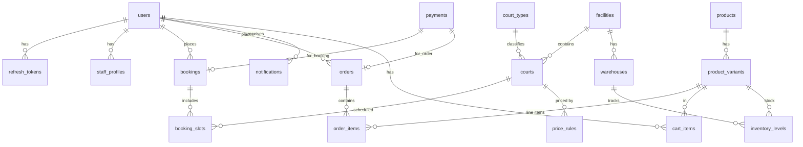

# Mô hình dữ liệu (ER, bảng, index, phân quyền)

## 1. Sơ đồ ER (Mermaid)

## 2. Bảng và mục đích

### 2.1 Người dùng & nhân viên

| Bảng | Cột chính | Mô tả |
|------|-----------|-------|
| `users` | id, full_name, email, phone, password_hash, avatar_url, role (`admin`\|`staff`\|`customer`), loyalty_points, created_at, updated_at | Tài khoản toàn hệ thống. Thêm `full_name`, `avatar_url` để hiển thị trên app; `loyalty_points` cho tính năng điểm tích lũy. |
| `staff_profiles` | id, user_id, facility_id (nullable → toàn hệ thống), job_title, active, created_at | Thông tin nhân viên theo cơ sở. |
| `refresh_tokens` | id, user_id, token_hash, expires_at, revoked (bool), created_at | Lưu trữ refresh token JWT. Cần thiết để thu hồi token khi đăng xuất hoặc khi token bị lộ. |

### 2.2 Cơ sở & sân

| Bảng | Cột chính | Mô tả |
|------|-----------|-------|
| `facilities` | id, name, address, timezone, open_time, close_time, avatar_url, cancel_policy (JSON), created_at | Chi nhánh / cơ sở thể thao. |
| `court_types` | id, name (`badminton`\|`tennis`\|`table_tennis`), surface, is_indoor, description | Loại sân; metadata phục vụ lọc và hiển thị. |
| `courts` | id, facility_id, court_type_id, name, code, status (`active`\|`maintenance`\|`inactive`), created_at | Sân cụ thể trong cơ sở. |

### 2.3 Giá theo khung giờ

| Bảng | Cột chính | Mô tả |
|------|-----------|-------|
| `price_rules` | id, court_id, day_of_week (0–6, NULL = mọi ngày), start_hour (0–23), end_hour (0–23), price_cents, active, created_at | Giá sân theo khung giờ và ngày trong tuần. Ưu tiên: rule có `court_id` cụ thể > rule theo `court_type`. Nếu không khớp → dùng giá mặc định của sân. |

### 2.4 Đặt sân

| Bảng | Cột chính | Mô tả |
|------|-----------|-------|
| `bookings` | id, user_id (nullable = walk-in), facility_id, status (`pending`\|`confirmed`\|`cancelled`\|`completed`\|`no_show`), payment_status, total_cents, note, promo_code_id (nullable), checked_in_at (nullable), cancelled_at (nullable), cancel_reason (nullable), created_at, updated_at | Đơn đặt sân. Bổ sung `note` (ghi chú khách), `checked_in_at` (QR check-in), `cancelled_at` + `cancel_reason` (hỗ trợ chính sách hủy). |
| `booking_slots` | id, booking_id, court_id, start_at, end_at, price_cents | Từng slot thời gian trong booking. **UNIQUE** `(court_id, start_at, end_at)` với status active để chống double booking. |

### 2.5 Sản phẩm & đơn hàng

| Bảng | Cột chính | Mô tả |
|------|-----------|-------|
| `products` | id, name, slug, category (`racket`\|`shuttlecock`\|`shoes`\|`apparel`\|`accessory`), description, thumbnail_url, rating, review_count, active, created_at | Sản phẩm bán lẻ. |
| `product_variants` | id, product_id, sku (UNIQUE), attributes (JSON: size, color), price_cents, barcode, created_at | Biến thể sản phẩm (size, màu sắc). |
| `cart_items` | id, user_id, variant_id, quantity, created_at, updated_at | Giỏ hàng server-side — đồng bộ giữa nhiều thiết bị. UNIQUE `(user_id, variant_id)`. |
| `orders` | id, user_id, facility_id, status (`pending`\|`confirmed`\|`completed`\|`cancelled`\|`refunded`), payment_method, subtotal_cents, discount_cents, total_cents, note, created_at, updated_at | Đơn hàng mua sản phẩm. |
| `order_items` | id, order_id, variant_id, quantity, unit_price_cents, discount_cents | Dòng sản phẩm trong đơn; lưu giá tại thời điểm mua (snapshot). |

### 2.6 Kho

| Bảng | Cột chính | Mô tả |
|------|-----------|-------|
| `warehouses` | id, facility_id, name, created_at | Kho hàng theo cơ sở. MVP 1 cơ sở → 1 kho. |
| `inventory_levels` | id, variant_id, warehouse_id, quantity_on_hand; UNIQUE `(variant_id, warehouse_id)` | Tồn kho hiện tại theo kho. |
| `inventory_movements` | id, variant_id, warehouse_id, qty_delta, reason (`sale`\|`return`\|`adjustment`\|`import`), ref_order_id (nullable), note, created_at | Lịch sử biến động kho; truy vết mọi thay đổi tồn kho. |

### 2.7 Khuyến mãi

| Bảng | Cột chính | Mô tả |
|------|-----------|-------|
| `promo_codes` | id, code (UNIQUE), type (`percent`\|`fixed`), value, min_order_cents, max_uses, used_count, expires_at, active, created_at | Mã khuyến mãi áp dụng cho booking hoặc đơn hàng. |

### 2.8 Thanh toán

| Bảng | Cột chính | Mô tả |
|------|-----------|-------|
| `payments` | id, provider (`manual_transfer`\|`sandbox`\|`momo`\|`vnpay`), status (`pending`\|`paid`\|`failed`\|`refunded`), amount_cents, booking_id (nullable), order_id (nullable), provider_ref, metadata (JSON), paid_at (nullable), created_at, updated_at | Giao dịch thanh toán dùng chung cho booking và đơn hàng. Chỉ một trong hai FK có giá trị tại một thời điểm. |

### 2.9 Thông báo

| Bảng | Cột chính | Mô tả |
|------|-----------|-------|
| `notifications` | id, user_id, type (`booking_confirmed`\|`booking_reminder`\|`order_status`\|`promotion`), title, body, is_read (bool), ref_type (nullable), ref_id (nullable), created_at | Thông báo trong app. `ref_type` + `ref_id` để deep-link vào đúng màn hình (booking, order...). |

### 2.10 Audit

| Bảng | Cột chính | Mô tả |
|------|-----------|-------|
| `audit_logs` | id, actor_user_id, action, entity_type, entity_id, payload (JSON), ip_address, created_at | Ghi lại mọi hành động quan trọng (tạo/sửa/xóa) để truy vết. |

---

## 3. Index gợi ý (MySQL)

| Index | Mục đích |
|-------|----------|
| `booking_slots (court_id, start_at, end_at)` | Truy vấn kiểm tra overlap slot nhanh |
| `bookings (facility_id, status, created_at)` | Lọc lịch theo trạng thái trong admin |
| `bookings (user_id, created_at DESC)` | Lịch sử đặt sân của khách |
| `orders (facility_id, created_at DESC)` | Báo cáo doanh thu theo cơ sở |
| `orders (user_id, created_at DESC)` | Lịch sử đơn hàng của khách |
| `product_variants (sku)` — UNIQUE | Tra cứu nhanh theo mã SKU |
| `users (email)` — UNIQUE | Đăng nhập, kiểm tra trùng email |
| `users (phone)` — UNIQUE | Kiểm tra trùng số điện thoại |
| `refresh_tokens (token_hash)` | Xác thực refresh token nhanh |
| `refresh_tokens (user_id, expires_at)` | Dọn token hết hạn |
| `payments (booking_id, status)` | Tra cứu payment theo booking |
| `payments (order_id, status)` | Tra cứu payment theo đơn hàng |
| `notifications (user_id, is_read, created_at DESC)` | Lấy danh sách thông báo chưa đọc |
| `cart_items (user_id)` | Lấy giỏ hàng của user |
| `inventory_levels (variant_id, warehouse_id)` — UNIQUE | Đảm bảo 1 bản ghi tồn kho / variant / kho |
| `price_rules (court_id, day_of_week, start_hour)` | Tra cứu giá theo khung giờ nhanh |

### Chống double booking (MySQL không có exclusion constraint như PostgreSQL)

- **Redis hold key** theo `court_id + time_range` trong khoảng TTL ngắn (5–10 phút) khi khách giữ slot.
- **Transaction + `SELECT ... FOR UPDATE`** khi xác nhận để lock row.
- **Kiểm tra overlap** bằng query: `start_at < req.end_at AND end_at > req.start_at` với `status IN ('pending', 'confirmed')`.

---

## 4. Phân quyền dữ liệu ở tầng ứng dụng (Node.js)

Nguyên tắc: mặc định **chặn**; chỉ mở theo role + scope cơ sở.

| Bảng | customer | staff | admin |
|------|----------|-------|-------|
| `users` | Chỉ đọc/ghi profile của mình | Đọc user theo facility | Toàn quyền |
| `bookings` | Chỉ xem booking của mình | Xem/duyệt booking ở facility phụ trách | Toàn quyền |
| `orders` | Chỉ xem đơn của mình | Xem/xử lý đơn ở facility phụ trách | Toàn quyền |
| `inventory_levels` | ❌ Không truy cập | Xem tồn kho | Xem + ghi |
| `inventory_movements` | ❌ Không truy cập | Xem lịch sử | Toàn quyền |
| `price_rules` | ❌ Không truy cập | Chỉ đọc | Toàn quyền |
| `audit_logs` | ❌ Không truy cập | ❌ Không truy cập | Toàn quyền |
| `notifications` | Chỉ đọc của mình | ❌ | Toàn quyền |
| `refresh_tokens` | Chỉ revoke của mình | ❌ | Toàn quyền |

**Triển khai:** middleware xác thực JWT, middleware phân quyền role (`admin`, `staff`, `customer`) kiểm tra `facility_id` trong service layer.

---

*Đồng bộ với schema thực tế trong repo (migration MySQL).*
